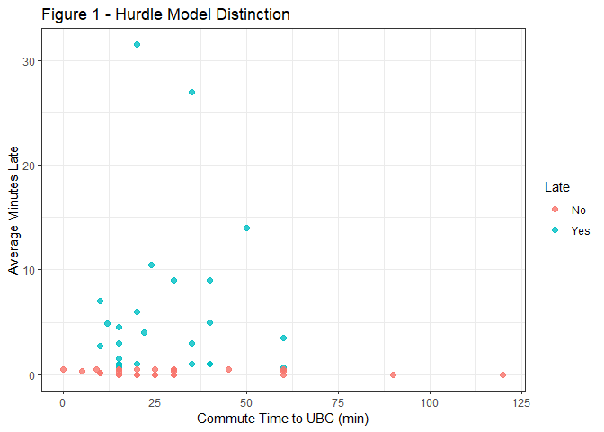
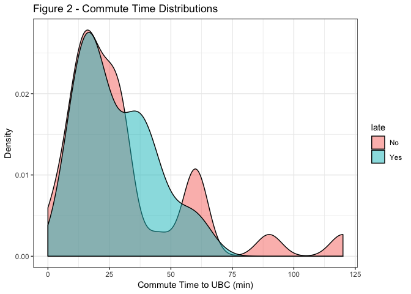
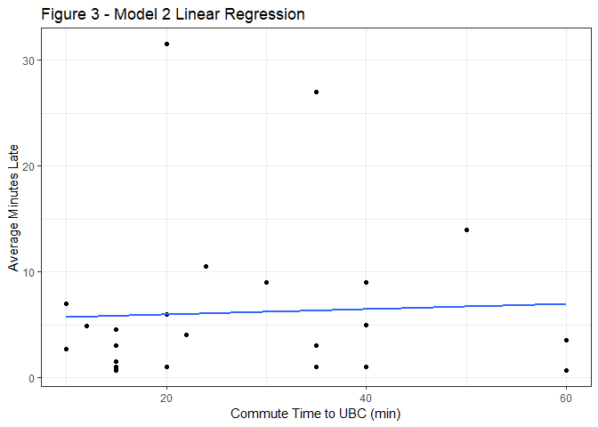

Analysis and Discussion
================

Introduction
------------

> To be filled in by Sreya

Methods and Analysis
--------------------

The [exploratory data analysis](https://github.com/UBC-MDS/running_late/blob/master/doc/eda_running_late.md) (EDA) conducted in milestone 2 brought to light several considerations for our analysis. We saw that the distribution of our response variable -`average minutes late`- is zero inflated with 29 of the 54 students (~54%) having an average minutes late value of less than 0.5. To appropriately model this distribution we considered a hurdle model. This approach first models the likelihood a student is late given their commute time. The second model only considers the students that arrived late or in other words the students that have surpassed the hurdle. It is important to note that these two models answer slightly different questions which is discussed in the following section. However, both questions pertain to our original question - What is the relationship between commute time and average minutes late? To highlight the distinction between observations that surpass the hurdle, we have illustrated the figure below.



To conduct this analysis we also need to consider confounding variables. In our original survey we gathered data on nine potential confounding variables. From our EDA we noticed some of the variables did not have sufficient observations across their levels. Additionally, the EDA also identified variables that had no apparent effect on our response variable. As such, we will focus our regression analysis and significance tests on four of the potential confounding variables. These variables are: `Q6.campus`,`Q7.sleep_type`,`Q10.clubs`,`Q11.breakfast`. For further details on each of these variables and this conclusion, please refer to our EDA document.

### Model 1: Does commute time increase your odds of being late?

The odds of being late given a students commute time is visualized below. From this plot we see that both students who arrive on time or who arrive late have similar distributions.



We can more formally test our observations from the plot above by fitting a logistic regression model. This results in an odds ratio close to 1 and as noted by the p value below, we can conclude that under the current model there is not sufficient evidence to suggest commute time affects whether a student is late.

``` r
df %>% glm(late ~ Q2.commute_time, family = "binomial", data = .) %>% tidy()
```

    ## # A tibble: 2 x 5
    ##   term            estimate std.error statistic p.value
    ##   <chr>              <dbl>     <dbl>     <dbl>   <dbl>
    ## 1 (Intercept)      0.0715     0.466      0.153   0.878
    ## 2 Q2.commute_time -0.00749    0.0130    -0.577   0.564

Of course, this does not take into account potential confounding variables. It is possible other variables are hiding the relationship between commute time and average minutes late. To uncover if this is the case we have included the four confounding variables into our regression model. As detailed below, sleep type is the only significant confounding variable.

``` r
df %>% glm(late ~ Q2.commute_time + Q6.campus + Q7.sleep_type + Q10.clubs + Q11.breakfast, family = "binomial", data = .) %>% tidy()
```

    ## # A tibble: 8 x 5
    ##   term                   estimate std.error statistic p.value
    ##   <chr>                     <dbl>     <dbl>     <dbl>   <dbl>
    ## 1 (Intercept)             -0.905     0.962     -0.941  0.347 
    ## 2 Q2.commute_time         -0.0120    0.0180    -0.664  0.507 
    ## 3 Q6.campusOn Campus      -0.940     0.820     -1.15   0.251 
    ## 4 Q7.sleep_typeNeither     1.25      0.836      1.49   0.136 
    ## 5 Q7.sleep_typeNight Owl   1.95      0.807      2.42   0.0156
    ## 6 Q10.clubsYes             0.614     0.708      0.867  0.386 
    ## 7 Q11.breakfastNeither     0.944     1.29       0.734  0.463 
    ## 8 Q11.breakfastOn Campus  -0.0866    0.790     -0.110  0.913

Focusing on our explanatory variable and sleep type (Removing Q6, Q10, Q11), we see there is still insufficient evidence to suggest commute time affects whether a student is late. It is interesting however to see that people who describe themselves as night owls are exp(1.79)=6 times more likely to arrive late than those who identify as a morning person.

``` r
df %>% glm(late ~ Q2.commute_time + Q7.sleep_type, family = "binomial", data = .) %>% tidy()
```

    ## # A tibble: 4 x 5
    ##   term                   estimate std.error statistic p.value
    ##   <chr>                     <dbl>     <dbl>     <dbl>   <dbl>
    ## 1 (Intercept)            -1.12       0.708     -1.58   0.115 
    ## 2 Q2.commute_time        -0.00429    0.0136    -0.315  0.753 
    ## 3 Q7.sleep_typeNeither    1.25       0.780      1.60   0.109 
    ## 4 Q7.sleep_typeNight Owl  1.79       0.723      2.48   0.0132

### Model 2: Of the students who arrive late, how does their commute time affect how late they arrive?

In the previous model we saw that there is no relationship between commute time and the odds of being late. This model attempts to further investigate the students who are late. The plot below illustrates this relationship (excluding confounding variables) and fits a linear model.



It is clear from the plot above that there is no significant relationship. This is confirmed by the linear model below.

``` r
df %>% filter(late == "Yes") %>% 
  lm(avg_late ~ Q2.commute_time, data = .) %>% tidy()
```

    ## # A tibble: 2 x 5
    ##   term            estimate std.error statistic p.value
    ##   <chr>              <dbl>     <dbl>     <dbl>   <dbl>
    ## 1 (Intercept)       5.45       3.40      1.60    0.123
    ## 2 Q2.commute_time   0.0248     0.108     0.229   0.821

Similar to Model 1, we need to consider the confounding variables. As detailed below we see that all of these variables have high p values. We can conclude that they are not confounding variables and our previous conclusion from the plot above holds.

``` r
df %>% filter(late == "Yes") %>% 
  lm(avg_late ~ Q2.commute_time + Q6.campus + Q7.sleep_type + Q10.clubs + Q11.breakfast, data = .) %>% tidy()
```

    ## # A tibble: 8 x 5
    ##   term                   estimate std.error statistic p.value
    ##   <chr>                     <dbl>     <dbl>     <dbl>   <dbl>
    ## 1 (Intercept)              6.04       7.36      0.820   0.424
    ## 2 Q2.commute_time         -0.0895     0.179    -0.499   0.624
    ## 3 Q6.campusOn Campus      -0.863      5.36     -0.161   0.874
    ## 4 Q7.sleep_typeNeither     3.24       5.96      0.544   0.593
    ## 5 Q7.sleep_typeNight Owl   5.06       5.29      0.957   0.352
    ## 6 Q10.clubsYes            -2.63       4.18     -0.630   0.537
    ## 7 Q11.breakfastNeither    -4.88       6.14     -0.795   0.438
    ## 8 Q11.breakfastOn Campus   2.99       4.47      0.668   0.513

Discussion and Study Design
---------------------------

The overall objective of our study was to investigate the relationship of commute time and average minutes late to class. We conducted the survey on MDS students in the 2018-2019 cohort do to data availability, but we considered this a reasonable sample to infer on the UBC population. Given the nature of our data and research question, this experiment was conducted as a cross sectional observational study. As such, to infer causation it was crucial to gather a lot of evidence and account for all the confounders. We did so by developing a survey with many questions in hopes to gather information on several possible confounders. After performing EDA and regression analysis only the sleep type was considered a significant confounder in Model 1. Our final conclusion in both model 1 and model 2 supported the null hypothesis that there is no relationship between commute time and average minutes late to class.

Do to our small sample size, we were unable to account for the confounding variables by stratification. This is because all the possible levels would result in groups that are too small and unstable for inference. Consequently, we modeled our variables in a regression analysis. This comes with the assumption of linearity. In future studies it would be advisable to collect more data so that we can relax some assumptions and have more certainty around our conclusion.

Finally, it is important to address a word of caution in our studies generalizability. We do not have supporting evidence that the MDS Cohort is a reasonable sample of the entire student body at UBC. For instance, it could be argued that undergraduate students behaviours around arriving late to class differs dramatically from the graduate student population. This impacts the outreach of our conclusion that commute time does not affect average minutes late.
