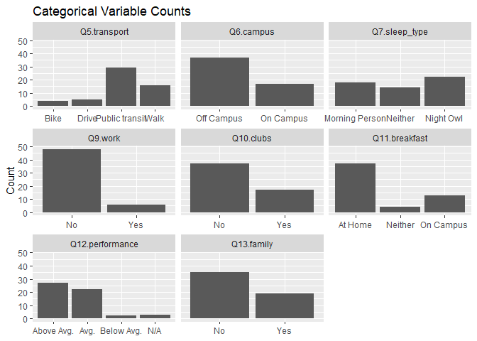
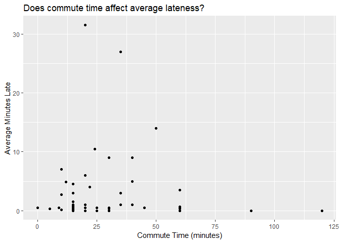
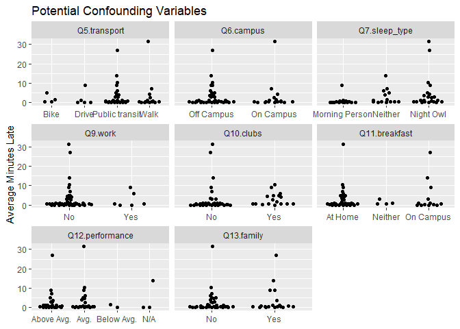
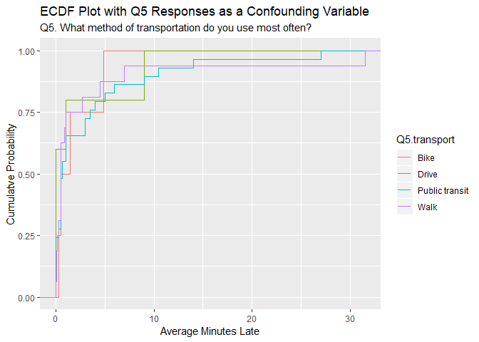
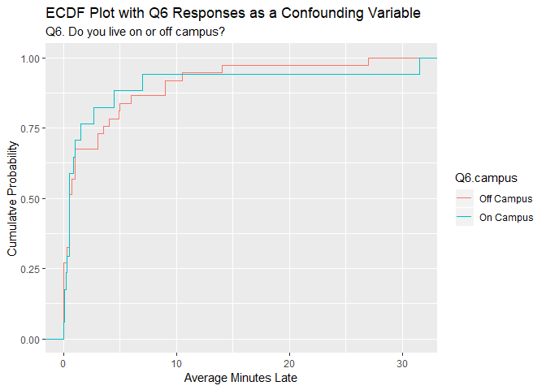

Exploratory Data Analysis (EDA)
================

Running Late Survey Data
------------------------

Team Members
- Alycia Butterworth
- Sreya Guha
- Fan Nie
- Aaron Quinton

The goal of this analysis is to explore the running late survey data we collected from the MDS 2018-2019 Cohort and teaching team. We received a total of 54 responses. Our question of interest is trying to understand if there is a relationship between commute time and the average late time students arrive for the first lecture. This analysis also aims to confirm our suspicions on several potential confounding variables.

The survey data was collected by qualtrics and the raw data is displayed below.

    ## # A tibble: 6 x 30
    ##   StartDate EndDate Status IPAddress Progress `Duration (in s~ Finished
    ##   <chr>     <chr>   <chr>  <chr>     <chr>    <chr>            <chr>   
    ## 1 Start Da~ End Da~ Respo~ IP Addre~ Progress Duration (in se~ Finished
    ## 2 "{\"Impo~ "{\"Im~ "{\"I~ "{\"Impo~ "{\"Imp~ "{\"ImportId\":~ "{\"Imp~
    ## 3 2019-04-~ 2019-0~ IP Ad~ 128.189.~ 100      110              True    
    ## 4 2019-04-~ 2019-0~ IP Ad~ 206.12.5~ 100      52               True    
    ## 5 2019-04-~ 2019-0~ IP Ad~ 128.189.~ 100      74               True    
    ## 6 2019-04-~ 2019-0~ IP Ad~ 206.87.2~ 100      116              True    
    ## # ... with 23 more variables: RecordedDate <chr>, ResponseId <chr>,
    ## #   RecipientLastName <chr>, RecipientFirstName <chr>,
    ## #   RecipientEmail <chr>, ExternalReference <chr>, LocationLatitude <chr>,
    ## #   LocationLongitude <chr>, DistributionChannel <chr>,
    ## #   UserLanguage <chr>, Q1 <chr>, Q2 <chr>, Q3 <chr>, Q4 <chr>, Q5 <chr>,
    ## #   Q6 <chr>, Q7 <chr>, Q8 <chr>, Q9 <chr>, Q10 <chr>, Q11 <chr>,
    ## #   Q12 <chr>, Q13 <chr>

As you can see the data is untidy. We have selected relevant columns, rows, and corrected the data types and column names. It is also important to note that the raw data considered two survey questions related to the response variable:
- During Blocks 1 through 6, what percentage of classes have you arrived late?
- If you answered a number greater than 0%, for the days you were late, what was the average time (in minutes) that you were late?

To prepare our data for analysis we multiplied the results of these two questions to estimate an overall score for our response variable - average lateness. Below is our cleaned data and summary statistics.

#### Data Variables:

-   `ave_late`: The multiplied value of percentage of classes the respondent arrived late by the average time in minutes that they were late
-   `Q2.commute_time`: The respondent's commute time to UBC in minutes (continuous variable)
-   `Q5.transport`: The respondent's most used method of transportation for commuting to school (categorical variable)
-   `Q6.campus`: Whether the respondent lives 'on campus' or 'off campus' (binary variable)
-   `Q7.sleep_type`: Does the respondent classify themselves as a 'morning person', 'night owl', or 'neither' (categorical variable)
-   `Q8.sleep_time`: How much sleep the respondent gets on an average night (continuous variable)
-   `Q9.work`: Does the respondent works part-time/full-time (binary variable)
-   `Q10.clubs`: Is the respondent a member of any clubs or extracurriculars (binary variable)
-   `Q11.breakfast`: Does the respondent eat/get breakfast/coffee in the morning 'at home', 'on campus', or 'neither' (categorical variable)
-   `Q12.performance`: How does the respondent perceive their performance in MDS (categorical variable)
-   `Q13.family`: Does the respondent live with a significant other, child(ren), and/or dog(s) (binary variable)

#### Cleaned Data Preview:

|  avg\_late|  Q2.commute\_time| Q5.transport   | Q6.campus  | Q7.sleep\_type |  Q8.sleep\_time| Q9.work | Q10.clubs | Q11.breakfast | Q12.performance | Q13.family |
|----------:|-----------------:|:---------------|:-----------|:---------------|---------------:|:--------|:----------|:--------------|:----------------|:-----------|
|        0.5|                30| Public transit | Off Campus | Morning Person |             8.0| No      | No        | At Home       | Above Avg.      | Yes        |
|        0.0|                25| Drive          | Off Campus | Morning Person |             7.0| No      | No        | At Home       | Avg.            | Yes        |
|        0.1|                10| Walk           | On Campus  | Morning Person |             7.0| No      | No        | At Home       | Avg.            | Yes        |
|        0.5|                25| Public transit | Off Campus | Neither        |             7.0| No      | No        | At Home       | Above Avg.      | No         |
|        0.0|                15| Walk           | On Campus  | Night Owl      |             7.5| No      | No        | On Campus     | N/A             | No         |
|        0.5|                60| Public transit | Off Campus | Morning Person |             8.0| No      | Yes       | At Home       | Above Avg.      | Yes        |

#### Summary Statistics:

    ##       ID               avg_late      Q2.commute_time          Q5.transport
    ##  Length:54          Min.   : 0.000   Min.   :  0.00   Bike          : 4   
    ##  Class :character   1st Qu.: 0.225   1st Qu.: 15.00   Drive         : 5   
    ##  Mode  :character   Median : 0.500   Median : 23.00   Public transit:29   
    ##                     Mean   : 2.976   Mean   : 29.57   Walk          :16   
    ##                     3rd Qu.: 3.000   3rd Qu.: 38.75                       
    ##                     Max.   :31.500   Max.   :120.00                       
    ##       Q6.campus         Q7.sleep_type Q8.sleep_time   Q9.work  Q10.clubs
    ##  Off Campus:37   Morning Person:18    Min.   :4.000   No :48   No :37   
    ##  On Campus :17   Neither       :14    1st Qu.:6.000   Yes: 6   Yes:17   
    ##                  Night Owl     :22    Median :6.875                     
    ##                                       Mean   :6.647                     
    ##                                       3rd Qu.:7.500                     
    ##                                       Max.   :8.500                     
    ##    Q11.breakfast   Q12.performance Q13.family
    ##  At Home  :37    Above Avg.:27     No :35    
    ##  Neither  : 4    Avg.      :22     Yes:19    
    ##  On Campus:13    Below Avg.: 2               
    ##                  N/A       : 3               
    ##                                              
    ## 

#### Data Visualization

First let's consider the distributions of the numerical variables. We see below that the majority of the students arrive to class on time and have a commute time less than 50 minutes. There is also a range of sleep schedules.

We have several categorical variables that potentially could be a confounding variable. The counts of these variables are visualized below.

The main relationship we are exploring is that between the average lateness and the commute time. The scatter plot below highlights this relationship and immediately suggests that there is no obvious association.

A possible trend in the above plot could be hidden by confounding variables. To further identify the relationship between our response variable and the potential confounding variables, we have included the visual below. Certain categories stand out as variables that are associated with average lateness. These variables are the method of transportation, whether they live on campus, sleep type, and whether they eat breakfast on campus, or at home.

To better illustrate the possible associations between the response variable and the variables identified in the previous graph, we have included the empirical cumulative distribution (ECDF) plots on each variable/survey question. These plots suggest that method of transportation is not very significant. Where as living on Campus slightly improves your time to school, and whether you are a morning person or don't have breakfast/coffee at school greatly improves your time to school.

