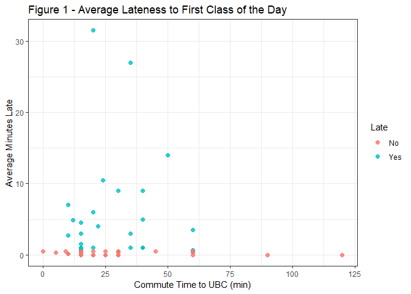
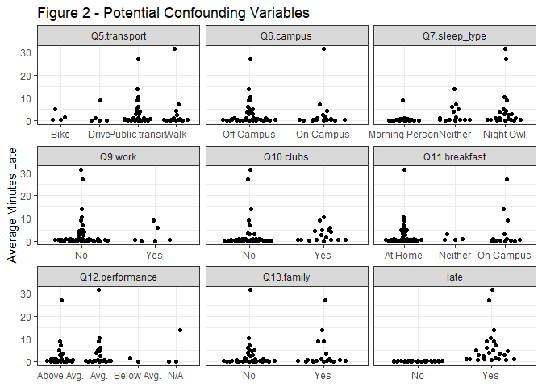
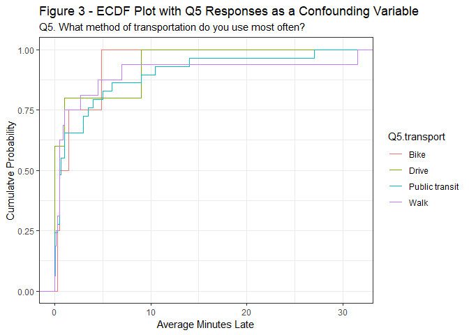
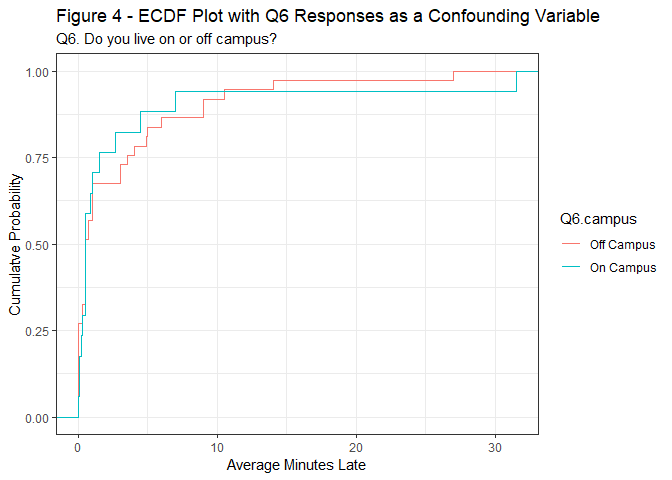
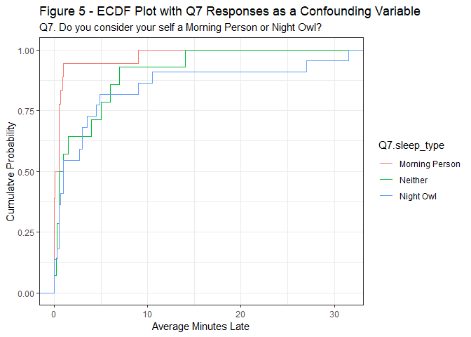
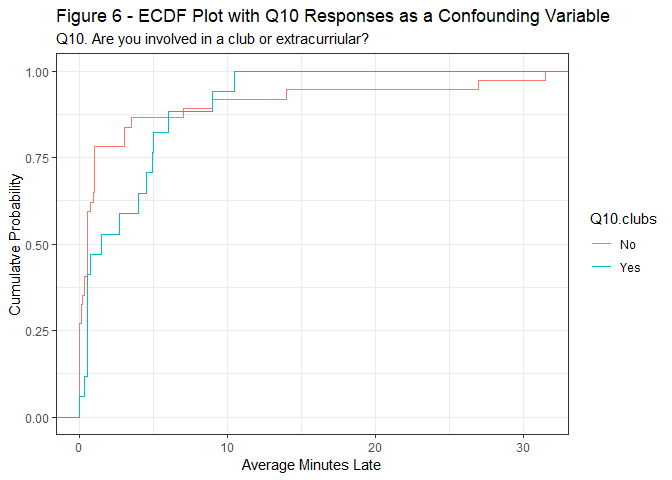
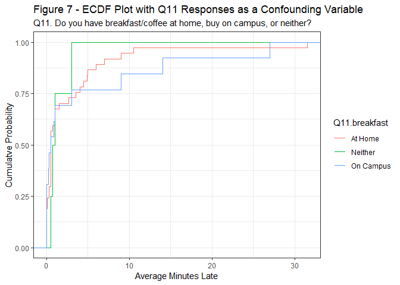
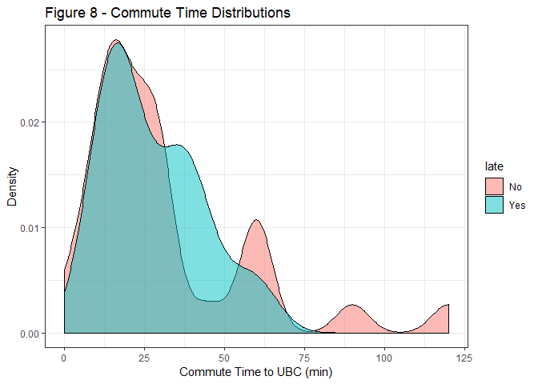
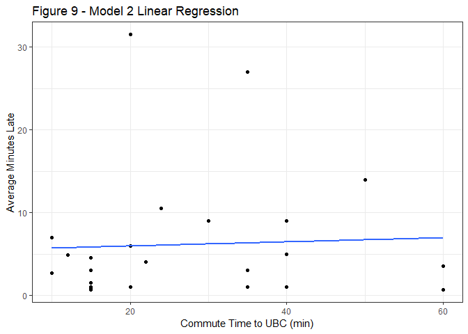

Final Report
================

Contributors
------------

-   Alycia Butterworth
-   Sreya Guha
-   Fan Nie
-   Aaron Quinton

Introduction
------------

When students come to class late, it can disrupt the flow of a lecture or discussion, distract other students, impede learning, and generally erode class morale. At its most extreme, teachers may have to start class 5-10 minutes late in order to account for late arrivals, which means that students will miss out on valuable instructional time on a daily basis. There are a number of possible reasons students arrive to class late. For example, going to bed late and waking up late next morning, an inherent anxiety level associated with attending school, etc. Inevitable circumstances along a student's way to school can also be one of the possible reasons why students are late to class. In some instances, a student may find it difficult to make it to class on time because of the physical distance between the student's home and school. This may be particularly true of students who live off-campus.

Our analysis tries to answer the question : **Does the commute time to UBC of a MDS student influence their late arrival time to the first class?**

-   *Null Hypothesis:* Commute time to UBC does NOT impact an MDS student's late arrival time to class.
-   *Alternative Hypothesis:* Commute time to UBC does impact an MDS student's late arrival time to class.

Survey Design
-------------

To address this question we surveyed students in the 2018-2019 MDS cohort to obtain data to conduct our analysis. We used the services provided by Qualtrics to make our survey. We provided a consent form to disclose the potential risk of re-identification of the anonymous data when combining with application information in the MDS program. The survey can be found here: [Running Late Survey](https://ubc.ca1.qualtrics.com/jfe/form/SV_3Jk3TZyscxiUZY9). To make the survey easy and less time consuming, most of the questions were multiple choice. We also avoided asking questions that might be sensitive, identifying, or have risk of involving in discrimination issues.

To answer the question of interest we asked the following questions:

1.  What is your average commute time (in minutes) to the University of British Columbia?
2.  During Blocks 1 through 6, what percentage of classes have you arrived late?
3.  If you answered a number greater than 0%, for the days you were late, what was the average time (in minutes) that you were late?
4.  What method of transportation do you use most often?
5.  Do you live on or off campus?
6.  Do you consider your self a Morning Person or Night Owl?
7.  How much sleep (in hours) do you get on an average night?
8.  Do you work part time?
9.  Are you involved in any clubs or extracurriculars?
10. Do you have breakfast/coffee at home, buy on campus, or neither?
11. How well do you perceive your performance in this program?
12. Do you live with a partner/family/dog?

The first question provides information about the main predictor. Questions 2 and 3 serve as the response. The other questions like amount of sleep, method of transportation, etc. are related to the confounding variables.

Data Variables
--------------

Our data variables are described below. The full data set can be found in [data/clean\_survey\_data.csv](https://github.com/UBC-MDS/running_late/blob/master/data/clean_survey_data.csv)

<table>
<colgroup>
<col width="22%" />
<col width="9%" />
<col width="68%" />
</colgroup>
<thead>
<tr class="header">
<th>Variable Name</th>
<th>Type</th>
<th>Description</th>
</tr>
</thead>
<tbody>
<tr class="odd">
<td><code>ave_late</code></td>
<td>continuous</td>
<td>The multiplied value of percentage of classes the respondent arrived late by the average time in minutes that they were late</td>
</tr>
<tr class="even">
<td><code>Q2.commute_time</code></td>
<td>continuous</td>
<td>The respondent's commute time to UBC in minutes</td>
</tr>
<tr class="odd">
<td><code>Q5.transport</code></td>
<td>categorical</td>
<td>The respondent's most used method of transportation for commuting to school</td>
</tr>
<tr class="even">
<td><code>Q6.campus</code></td>
<td>binary</td>
<td>Whether the respondent lives 'on campus' or 'off campus'</td>
</tr>
<tr class="odd">
<td><code>Q7.sleep_type</code></td>
<td>categorical</td>
<td>Does the respondent classify themselves as a 'morning person', 'night owl', or 'neither'</td>
</tr>
<tr class="even">
<td><code>Q8.sleep_time</code></td>
<td>continuous</td>
<td>How much sleep the respondent gets on an average night</td>
</tr>
<tr class="odd">
<td><code>Q9.work</code></td>
<td>binary</td>
<td>Does the respondent works part-time/full-time</td>
</tr>
<tr class="even">
<td><code>Q10.clubs</code></td>
<td>binary</td>
<td>Is the respondent a member of any clubs or extracurriculars</td>
</tr>
<tr class="odd">
<td><code>Q11.breakfast</code></td>
<td>categorical</td>
<td>Does the respondent eat/get breakfast/coffee in the morning 'at home', 'on campus', or 'neither'</td>
</tr>
<tr class="even">
<td><code>Q12.performance</code></td>
<td>categorical</td>
<td>How does the respondent perceive their performance in MDS</td>
</tr>
<tr class="odd">
<td><code>Q13.family</code></td>
<td>binary</td>
<td>Does the respondent live with a significant other, child(ren), and/or dog(s)</td>
</tr>
</tbody>
</table>

Key EDA
-------

The [exploratory data analysis](https://github.com/UBC-MDS/running_late/blob/master/doc/eda_running_late.md) (EDA) conducted in milestone 2 brought to light several considerations for our analysis. You can click on the link to view the full EDA, however we have included the key findings and charts below.

One major finding in our EDA is that the distribution of our response variable -`average minutes late`- is zero inflated with 29 of the 54 students (~54%) having an average minutes late value of less than 0.5. We will address this in our analysis.



In order to prove causation in our survey, we collected information on potentially confounding variables. In our original survey we gathered data on nine potential confounding variables. Below, you can see the distribution of answers about those variables. Certain categories stand out as variables that are associated with average lateness. These variables are the method of transportation, whether they live on campus, sleep type, whether they are in a club and whether they eat breakfast on campus, or at home.



To better illustrate the possible associations between the response variable and the variables identified in the previous graph, we have included the empirical cumulative distribution (ECDF) plots on each variable/survey question. These plots suggest that method of transportation is not very significant, whereas living on campus slightly improves your timeliness to school, not being involved in a club improves your timeliness to school, and whether you are a morning person or don't have breakfast/coffee at school greatly improves your timeliness to school.



Methods and Analysis
--------------------

Due to our data being highly zero inflated, we decided that to appropriately model this distribution we would need a hurdle model. In this approach, the first model (model 1) is the likelihood a student is late given their commute time. The second model (model 2) only considers the students that arrived late or in other words the students that have surpassed the hurdle. It is important to note that these two models answer slightly different questions which is discussed in the following section. However, both questions pertain to our original question - What is the relationship between commute time and average minutes late?

To conduct this analysis we also need to consider confounding variables. From our EDA, we noticed some of the variables did not have sufficient observations across all levels. Additionally, the EDA also identified variables that had no apparent effect on our response variable. As such, we will focus our regression analysis and significance tests on four of the potential confounding variables. These variables are: `Q6.campus`,`Q7.sleep_type`,`Q10.clubs`,`Q11.breakfast`.

### Model 1: Does commute time impact your odds of being late?

The odds of being late given a students commute time is visualized below. From this plot we see that both students who arrive on time or who arrive late have similar distributions.



We can more formally test our observations from the plot above by fitting a logistic regression model. As noted by the p value below, we can conclude that under the current model there is not sufficient evidence to suggest commute time affects whether a student is late.

``` r
df %>% glm(late ~ Q2.commute_time, family = "binomial", data = .) %>% tidy() %>% kable
```

| term             |    estimate|  std.error|   statistic|    p.value|
|:-----------------|-----------:|----------:|-----------:|----------:|
| (Intercept)      |   0.0714786|  0.4661463|   0.1533394|  0.8781306|
| Q2.commute\_time |  -0.0074892|  0.0129753|  -0.5771925|  0.5638094|

Of course, this does not take into account potential confounding variables. It is possible other variables are hiding the relationship between commute time and average minutes late. To uncover if this is the case we have included the four confounding variables into our regression model. As detailed below, sleep type is the only significant confounding variable.

``` r
df %>% glm(late ~ Q2.commute_time + Q6.campus + Q7.sleep_type + Q10.clubs + Q11.breakfast, family = "binomial", data = .) %>% tidy() %>% kable
```

| term                    |    estimate|  std.error|   statistic|    p.value|
|:------------------------|-----------:|----------:|-----------:|----------:|
| (Intercept)             |  -0.9052067|  0.9624058|  -0.9405666|  0.3469270|
| Q2.commute\_time        |  -0.0119627|  0.0180187|  -0.6639058|  0.5067506|
| Q6.campusOn Campus      |  -0.9402329|  0.8196647|  -1.1470945|  0.2513426|
| Q7.sleep\_typeNeither   |   1.2475233|  0.8363492|   1.4916296|  0.1357963|
| Q7.sleep\_typeNight Owl |   1.9513631|  0.8067054|   2.4189289|  0.0155663|
| Q10.clubsYes            |   0.6143332|  0.7081887|   0.8674710|  0.3856840|
| Q11.breakfastNeither    |   0.9442026|  1.2863825|   0.7339983|  0.4629498|
| Q11.breakfastOn Campus  |  -0.0866298|  0.7901528|  -0.1096368|  0.9126974|

Focusing on our explanatory variable and sleep type (Removing Q6, Q10, Q11), we see there is still insufficient evidence to suggest commute time affects whether a student is late. It is interesting however to see that people who describe themselves as night owls are exp(1.79)=6 times more likely to arrive late than those who identify as a morning person.

``` r
df %>% glm(late ~ Q2.commute_time + Q7.sleep_type, family = "binomial", data = .) %>% tidy() %>% kable
```

| term                    |    estimate|  std.error|   statistic|    p.value|
|:------------------------|-----------:|----------:|-----------:|----------:|
| (Intercept)             |  -1.1168325|  0.7084122|  -1.5765291|  0.1149039|
| Q2.commute\_time        |  -0.0042914|  0.0136288|  -0.3148794|  0.7528532|
| Q7.sleep\_typeNeither   |   1.2504764|  0.7800934|   1.6029830|  0.1089384|
| Q7.sleep\_typeNight Owl |   1.7903126|  0.7226310|   2.4774920|  0.0132309|

### Model 2: Of the students who arrive late, how does their commute time affect how late they arrive?

In the previous model we saw that there is no relationship between commute time and the odds of being late. This model attempts to further investigate the students who are late. The plot below illustrates this relationship (excluding confounding variables) and fits a linear model.



It is clear from the plot above that there is no significant relationship. This is confirmed by the linear model below.

``` r
df %>% filter(late == "Yes") %>% 
  lm(avg_late ~ Q2.commute_time, data = .) %>% tidy() %>% kable
```

| term             |   estimate|  std.error|  statistic|    p.value|
|:-----------------|----------:|----------:|----------:|----------:|
| (Intercept)      |  5.4477265|  3.3990916|  1.6027007|  0.1226468|
| Q2.commute\_time |  0.0248295|  0.1082953|  0.2292759|  0.8206811|

Similar to Model 1, we need to consider the confounding variables. As detailed below we see that all of these variables have high p values. We can conclude that they are not confounding variables and our previous conclusion from the plot above holds.

``` r
df %>% filter(late == "Yes") %>% 
  lm(avg_late ~ Q2.commute_time + Q6.campus + Q7.sleep_type + Q10.clubs + Q11.breakfast, data = .) %>% tidy() %>% kable
```

| term                    |    estimate|  std.error|   statistic|    p.value|
|:------------------------|-----------:|----------:|-----------:|----------:|
| (Intercept)             |   6.0366666|  7.3633566|   0.8198254|  0.4236616|
| Q2.commute\_time        |  -0.0895232|  0.1794835|  -0.4987822|  0.6243251|
| Q6.campusOn Campus      |  -0.8625108|  5.3603746|  -0.1609049|  0.8740649|
| Q7.sleep\_typeNeither   |   3.2412941|  5.9578394|   0.5440385|  0.5934793|
| Q7.sleep\_typeNight Owl |   5.0632307|  5.2887622|   0.9573565|  0.3518053|
| Q10.clubsYes            |  -2.6299695|  4.1769187|  -0.6296435|  0.5372990|
| Q11.breakfastNeither    |  -4.8799565|  6.1392250|  -0.7948815|  0.4376399|
| Q11.breakfastOn Campus  |   2.9876243|  4.4693981|   0.6684623|  0.5128136|

Results
-------

The overall objective of our study was to investigate the relationship of commute time and average minutes late to class. We conducted the survey on MDS students in the 2018-2019 cohort (due to availability), but we considered this a reasonable sample to infer on the UBC population. Given the nature of our data and research question, this experiment was conducted as a cross-sectional observational study. As such, to infer causation it was crucial to account for all the confounders. We did so by developing a survey with many questions in hopes to gather information on several possible confounders. After performing EDA and regression analysis only the sleep type was considered a significant confounder in Model 1. No other variables, including the key variable, commute time, were found to be significant in both model 1 or model 2 at the 95% significance level. Our final conclusion in both model 1 and model 2 supported the null hypothesis that there is no relationship between commute time and average minutes late to class.

Study Design & Concluding Remarks
---------------------------------

Due to our small sample size, we were unable to account for the confounding variables by stratification. This is because all the possible levels would result in groups that are too small and unstable for inference. Consequently, we modeled our variables in a regression analysis. This comes with the assumption of linearity. In future studies, it would be advisable to collect more data so that we can relax some assumptions and have more certainty around our conclusion.

Finally, it is important to address a word of caution in our studies generalizability. Though we considered our data to be a reasonable sample of the UBC student body, we do not have supporting evidence that the responses of the MDS Cohort can be generalized to the full population of UBC students.For instance, it could be argued that undergraduate students behaviours around arriving late to class differs dramatically from the graduate student population. This impacts the outreach of our conclusion that commute time does not affect average minutes late. Therefore, we recommend that more data be collected prior to generalizing our results to the entire UBC student body.
